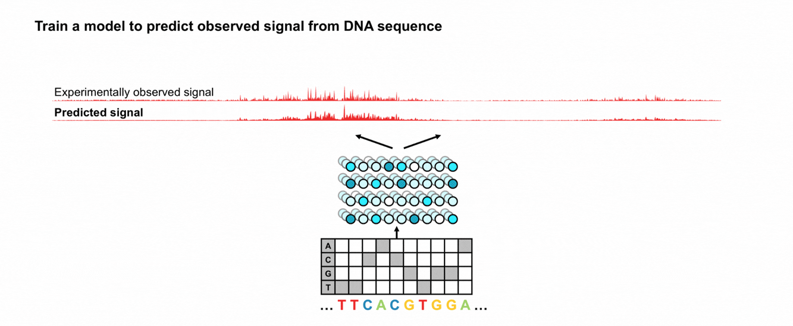
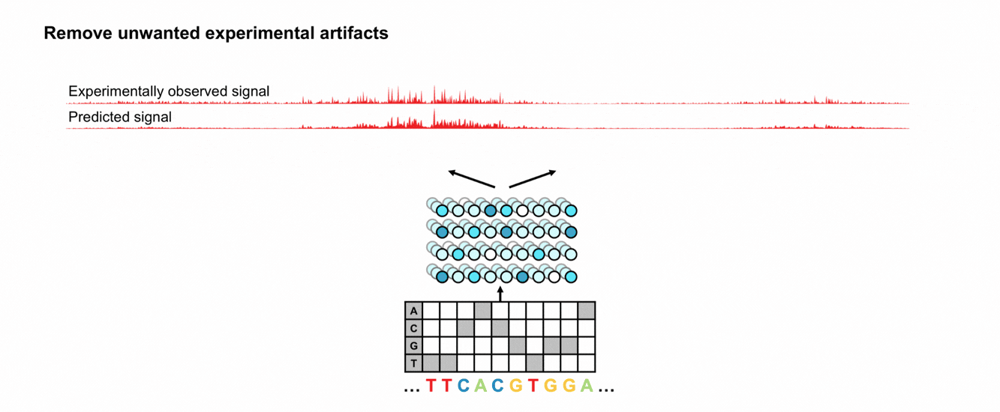
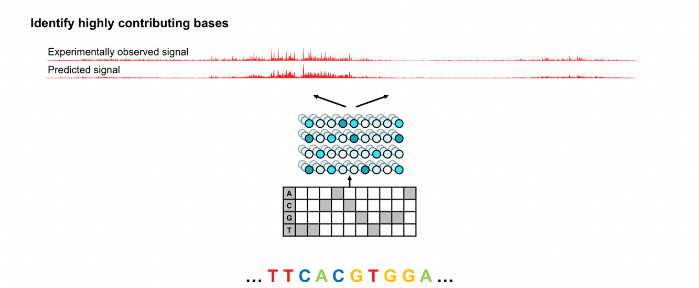
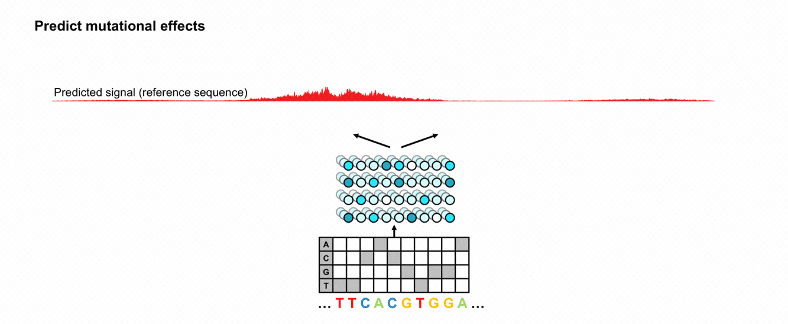


The Encyclopedia of DNA Elements (ENCODE) provides a reference map of functional elements in the human genome. This work reflects more than two decades of systematic investigation into genome function and is described in our recent manuscript on the fourth and final phase of the [**ENCODE Project**](https://doi.org/10.64898/2026.07.06.731365).
As part of this effort, we developed BPNet-GARDEN (BPNet-style reGulAtory DNA deep learning models trained on ENCODE)have released–a collection of deep learning models trained on approximately 4,000 datasets spanning multiple layers of gene regulation, including transcription-factor binding, chromatin accessibility, transcription initiation, and regulatory activity. Along with the trained models, we provide model predictions, sequence-interpretation scores, discovered motifs, and their genomic instances to support a wide range of gene-regulatory analyses.
In this first post of a broader series, we introduce BPNet-GARDENthe ENCODE Deep Learning Collection and illustrate how it can be used to uncover the sequence rules underlying gene regulation. Over the coming weeks, we will share additional articles highlighting other applications of this resource.
**Contributions**:
- Primary contributors: Vivekanandan Ramalingam, Chang M. Yun, Vivian Hecht, Aman Patel, Anusri Pampari, Ziwei Chen, Johannes Linder
- Secondary contributors: Georgi K. Marinov, Kelly Cochran, Abhimanyu Banerjee, Surag Nair, Salil S. Deshpande, Zahoor Zafrulla
- Tertiary contributors: Alex M. Tseng, Amr Alexandari, Mahfuza Sharmin, Avanti Shrikumar, Jacob M. Schreiber, Caleb Lareau
- Corresponding contributors: Anshul Kundaje
- Blog post: Chang M. Yun, Vivekanandan Ramalingam, Vivian Hecht (equal contributions)


> This post is the first of a series of blogs we will be releasing on the “ENCODE Deep Learning Collection”. We plan to release the following posts:
> 1. **Overview: What is the ENCODE Deep Learning Collection? (this post)**
> 1. Quickstart guide : How to access the ENCODE Deep Learning Collection
> 1. Understanding regulatory DNA using deep learning models
> 1. A guide to the DECODE BPNet model resource for modeling TF binding
> 1. A guide to the DECODE ChromBPNet resource for modeling chromatin accessibility
> 1. Case study #1: Predicting the effects of non-coding variant mutations
> 1. Case study #2: MotifCompendium: A unified lexicon of regulatory sequence motifs
> 1. Case study #3: Understanding cell type-specific activity of cis-regulatory elements
> 1. Postscript: successfully running production-scale projects in an academic setting

## DNA: not just genes
The human genome contains approximately 3.2 billion base pairs of DNA. While we often think of genes as the primary component of DNA, they account for only 1-2% of the genome. Gene expression, the process by which genes are converted into functional products, is a highly regulated process–genes are expressed at varying rates, and sometimes not at all–that is fundamental to the function of all living things. Many portions of the 98% of DNA not containing genes, also known as non-coding DNA, play a major role in regulating gene expression, as do the higher-order organization of DNA and various proteins that bind to it. 

DNA is organized into a higher-order structure called chromatin, which includes structural proteins as well as transcription factors (TFs), or proteins that bind to DNA to up- or down-regulate gene expression. Similarly to thread wound around a spool, not all chromatin is accessible at all times, and binding of various TFs both influences and is determined by chromatin accessibility. Chromatin is highly cell- and species-specific, and plays an essential role in cell differentiation and responses to environmental stimuli such as nutrient stress; moreover, chromatin dysregulation can lead to improper interactions between regulatory elements and genes, which can in turn lead to cancer and other diseases. 
 
## ENCODE: An Encyclopedia of DNA Elements
The [**Encyclopedia of DNA Elements** (**ENCODE**) Consortium](https://www.encodeproject.org/), a public research project dedicated to building a comprehensive "Encyclopedia" of genome-wide regulatory elements has made major contributions towards characterizing the complex and diverse components of the regulatory landscape. We describe a few of the experimental methods that researchers in the field have developed to interrogate chromatin accessibility below.

**TF ChIP-seq**, or TF chromatin immunoprecipitation, is used to identify TF binding sites, one TF at a time, by using antibodies to bind a given TF that is, in turn, bound to particular regions of DNA. These bound regions are then isolated and sequenced, with reads accumulating at TF binding sites. TF-ChIP-seq datasets are typically analyzed to identify peaks from these accumulated reads. Short DNA sequences that are statistically enriched within these peaks can then be identified as candidate motifs that may contribute to transcription-factor binding.

 TF binds to accessible DNA; (2) DNA is broken into fragments; (3) Antibodies bind to TF-DNA complex; (4) TF-DNA complex is pulled down; (5) Isolated DNA is cleaned and sequenced; (6) Sequences accumulate around the TF binding site.")

In **DNase-seq** and **ATAC-seq**, DNA-digesting enzymes (DNase I and Tn5 transposase, respectively) cut accessible chromatin into small fragments. These fragments are then isolated and sequenced, and accumulate in regions of open chromatin, analogously to TF-ChIP-seq. Worth noting is that DNase I and Tn5 transposase bind to specific DNA sequences, in addition to in open chromatin, leading to a slight bias in the form of an increased number of reads to particular regions. We discuss this further in subsequent sections.

 DNA can wrap around histones ('closed') or remain unwound ('open'); (2) Enzymes (DNase I or Tn5 transposase) cut accessible DNA; (3) DNA fragments are sequenced; (4) Accessible regions appear as peaks.")

In addition to chromatin accessibility and transcription factor binding, gene expression is further regulated in the moments preceding transcription. **PRO-cap** uses a process of DNA-tagging and capture to determine the position of RNA polymerase II (Pol II), a protein which transcribes DNA to RNA transcription initiation. Accumulating Pol II indicates positions of transcriptional regulation, and these can be detected via accumulation of PRO-cap reads at particular genomic locations.
 
And **MPRAs** and related high throughput reporter assays are used to experimentally measure whether particular sequences are in fact responsible for regulating gene expression. In general, a candidate Cis-Regulatory Element, or cCRE, is inserted into a short sequence which also includes a measurable reporter output, such as a fluorescent molecule. The greater the level of the measured reporter, the more active the regulatory element.

ENCODE has developed a set of approximately 16,000 standardized, uniformly processed datasets for the assays described above and many others, across a wide range of cell lines, primary cells and tissues. These are organized and publicly available for download via the [ENCODE portal](https://encodeproject.org). The consortium recently released a preprint describing the newly included datasets in the fourth and final phase of the project [ENCODE 4](https://www.biorxiv.org/content/10.64898/2026.07.06.731365v1).

. (https://doi.org/10.1038/nature14248)")
Coverage of the ENCODE Project: hundreds of biochemical markers, performed in hundreds of cell types and tissues, measured across 3 billion genomic positions. From _Roadmap Epigenomics Consortium et al. Integrative analysis of 111 reference human epigenomes. Nature 518, 317–330 (2015). ([https://doi.org/10.1038/nature14248](https://doi.org/10.1038/nature14248))_
 
## The BPNet family of deep learning models can help uncover the mechanisms of regulation
However, while the signals from the experimental assays can help map the locations of active regulatory genomic elements, they do provide limited mechanistic insights, and we are left with some fundamental questions, for example:

*Which sequence features drive TF binding and chromatin accessibility? 
*How do combinations and arrangements of motifs influence TF occupancy? 
*What would happen if an individual nucleotide were altered? 
*Is a disease-causing mutation causing its effect via changes to a transcription factor binding site?

Our group has developed a suite of deep learning models and downstream tools to address these questions. They include:
- **BPNet:** A convolutional neural network (CNN) trained on TF-ChIP-seq that predicts the binding of a TF from DNA sequence;
- **ChromBPNet:** A CNN with a BPNet-like architecture trained on DNase- or ATAC-seq that predicts chromatin accessibility from DNA sequence and corrects for enzymatic bias;
- **ProCapNet:** A CNN with a BPNet-like architecture trained on ProCAP-seq that predicts transcription initiation from DNA sequence;
- **ReporterNet:** A CNN with a BPNet-like architecture trained on MPRA data that predicts large-scale reporter assay signal from DNA sequence.

We describe the basic steps of our workflow below, with more detailed explanations available in the manuscripts [ChromBPNet, BPNet, ProCapNet, ReporterNet].

**1.** We begin by training a model that can reconstruct the observed experimental signal when provided the DNA sequence of the region. We expect that the model should only be able to perform this reconstruction by learning the underlying rules of chromatin regulation. While the input data varies based on assay, the basic model architecture remains the same.

DNase and ATAC-seq suffer from unwanted artifacts related to the preference of DNase and Tn5 to cut at specific sequence positions. Using ChromBPNet, we train a separate model to predict only the effects of the experimental artifact, and subtract its effect to isolate the regulatory signal.

**2.**We next interpret the weights of the trained model to understand which positions in the training sequences were most important to its predictions using DeepLIFT (ref). The most important positions, and bases at those positions, can often be directly attributed to the sequence binding preference of known transcription factors.   

**3.** Once we have the sequence interpretations we use a suite of post-processing tools to extract, consolidate and cluster the potential transcription factor binding sites. We also map the sites back to the genome, which is very useful for downstream quantitative analyses. 

 An example application, shown below, is to predict the effect of unseen mutations in the genome. This can be particularly useful, for example, for identifying causal mutations. 

In the following section, we share an example in the MYC locus to showcase the power of the models:

.")
Example BPNet-style model architecture with bias-correction: ChromBPNet. From _Pampari, A. et al. ChromBPNet: bias factorized, base-resolution deep learning models of chromatin accessibility reveal cis-regulatory sequence syntax, transcription factor footprints and regulatory variants. _bioRxiv_ 2024.12.25.630221 (2024). ([https://doi.org/10.1101/2024.12.25.630221](https://doi.org/10.1101/2024.12.25.630221))_

## Case study: Regulation in the MYC locus through the lens of deep learning models
The Myc family of proteins is a set of transcription factors that play an important role in cell proliferation, and mutations in the MYC gene have been shown to lead to many different types of cancer. Thus, understanding the mechanisms of regulation at the MYC locus with base-pair resolution can allow us to answer important questions relating to disease biology, Below, we view a CRISPRi-validated distal enhancer in the MYC locus [chr8:127,898,412—127,899,647] through the lens of 15 different models.

First, examining chromatin accessibility through ChromBPNet models: the models recapitulate the observed experimental profile with high concordance. Further, the models can de-noise the profile to isolate the true underlying accessibility signal, reconciling DNase and ATAC-seq experimental methods into agreement (where raw signals can diverge due to enzyme differences).
 

 
Second, using the models, we highlight the key sequence drivers that the models identified to make their predictions (as "contribution scores"), and begin to see the underlying biological mechanism of regulation at this locus:

Examining the highly contributing sequences for chromatin accessibility through ChromBPNet, we observe key transcription factors (e.g., GATA, AP1, SP, ETV) that drive accessibility—in agreement with prior understanding.

In parallel, examining the key sequences for TF binding through BPNet, we observe the same sequences predict TF binding, in agreement with ChromBPNet—despite being trained on two entirely orthogonal assay types (TF ChIP-seq vs. DNase-seq/ATAC-seq).

, MPRA (ReporterNet), and TF ChIP-seq models (BPNet; e.g., GATA2, SP1, CEBPB, JUND, GABPB1), with high-impact motif instances annotated (e.g., GATA, SP, AP-1, ETV/ETS, CEBP).")
 
Finally, we can repeat the analysis for HepG2 (also showing high concordance and known sequence motifs), and compare the highly contributing sequences between K562 vs. HepG2: we see some agreement (e.g., AP1, SP, ETV), but also some that disappear (e.g., GATA), while others that newly appear (e.g., FOX) in HepG2—showcasing the cell type variation of this enhancer.
 

 
Below, we provide an interactive browser session of the exact locus to view dynamically:

 

## Decoding ENCODE: An 'Encyclopedia' of regulatory DNA deep learning models
In the ENCODE Deep learning collection (De-ENCODE), we trained these models on hundreds of cell and tissue types available through the ENCODE consortium. We trained [BPNet](https://doi.org/10.1038/s41588-021-00782-6) models on 2,339 TF-ChIP-seq across 788 TFs, [ChromBPNet](https://doi.org/10.1101/2024.12.25.630221) models on 1,512 DNase-seq and ATAC-seq across 408 biosamples, [ProCapNet](https://doi.org/10.1101/2024.05.28.596138) models on 6 PRO-Cap, and ReporterNet models on 8 MPRAs to capture the dynamic regulatory activity across diverse samples. We release them together with the fourth and final phase of the ENCODE Project.
 
Through the power of the models and the richness of the ENCODE dataset, we hope to empower the community at large to explore important questions relating to the fundamental biology of gene regulation and mechanisms of disease in a wide variety of tissues and cell types. 

## How can I use the resource?
As part of the ENCODE Project, all data, models, analysis are available at the [Project portal](https://www.encodeproject.org/). If you use our models, please cite the [ENCODE preprint](https://doi.org/10.64898/2026.07.06.731365). 

Beyond the ENCODE portal, we provide several user-friendly alternatives for accessing and visualizing our data: 
- **Models**: We have uploaded the models for open access on [**Hugging Face**](https://huggingface.co/collections/kundajelab/encode-bpnet-models)
- **Predictions, contributions, and instances**: We have created a [**UCSC Track Hub**](https://genome.ucsc.edu/cgi-bin/hgTracks?db=hg38&hubUrl=https://kundajelab.github.io/ucsc-trackhub-encode.github.io/hub.txt) for easy, interactive browser sessions
- **User guide**: We are currently building an _interactive_ user guide to help the community navigate and explain the resource (_work in progress_)
- **Preprint**: For more detail, the latest ENCODE preprint is out on [_bioRxiv_](https://doi.org/10.64898/2026.07.06.731365)
 
We still have so much to share about the resource! We are planning to regularly share the many different ways you can use the resource (~every week) for the foreseeable future, so give us a follow and be on the lookout for more.

## References
1. The ENCODE Project Consortium et al. The Encyclopedia of DNA Elements. _bioRxiv_ 2026.07.06.731365 (2026) ([https://doi.org/10.64898/2026.07.06.731365](https://doi.org/10.64898/2026.07.06.731365))
2. Avsec, Ž. et al. Base-resolution models of transcription-factor binding reveal soft motif syntax. _Nat Genet_ 53, 354—366 (2021). ([https://doi.org/10.1038/s41588-021-00782-6](https://doi.org/10.1038/s41588-021-00782-6))
3. Pampari, A. et al. ChromBPNet: bias factorized, base-resolution deep learning models of chromatin accessibility reveal cis-regulatory sequence syntax, transcription factor footprints and regulatory variants. _bioRxiv_ 2024.12.25.630221 (2024). ([https://doi.org/10.1101/2024.12.25.630221](https://doi.org/10.1101/2024.12.25.630221))
4. Cochran, K. et al. Dissecting the cis-regulatory syntax of transcription initiation with deep learning. _bioRxiv_ 2024.05.28.596138 (2024). ([https://doi.org/10.1101/2024.05.28.596138](https://doi.org/10.1101/2024.05.28.596138))
5. Yun, C. M. et al. A unified lexicon of predictive DNA sequence motifs from ENCODE transcription factor binding and chromatin accessibility assays. (2025) doi:10.5281/zenodo.17179111. ([https://doi.org/10.5281/zenodo.17179111](https://doi.org/10.5281/zenodo.17179111))

