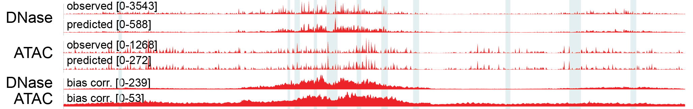
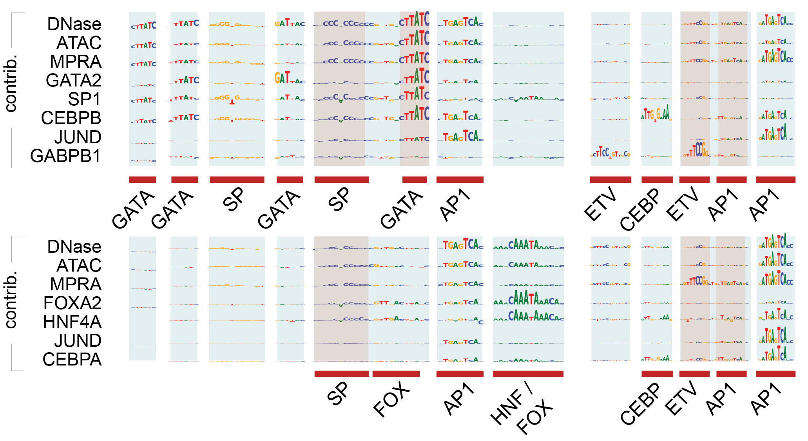


The 4th and final phase of the [**ENCODE Project**](https://doi.org/10.64898/2026.07.06.731365) is released today for **free and unrestricted public use**. We trained [BPNet](https://doi.org/10.1038/s41588-021-00782-6) models on 2,339 TF-ChIP-seq across 788 TFs, [ChromBPNet](https://doi.org/10.1101/2024.12.25.630221) models on 1,512 DNase-seq and ATAC-seq across 408 samples, [ProCapNet](https://doi.org/10.1101/2024.05.28.596138) models on 6 PRO-Cap, and ReporterNet models on 8 MPRAs as part of the Project. We showcase an example of how to use the models to understand the underlying rules of regulation. We share all models, predictions, interpretation scores, discovered motifs, and genomic instances for open use. We plan to share new stories about how to use the resource over the next several weeks.

**Contributions**:
- Primary contributors: Vivekanandan Ramalingam, Chang M. Yun, Vivian Hecht, Aman Patel, Anusri Pampari, Ziwei Chen, Johannes Linder, Soumya Kundu, Ivy Evergreen, Austin Wang, Daniel Kim, Eran Kotler
- Secondary contributors: Georgi K. Marinov, Kelly Cochran, Abhimanyu Banerjee, Surag Nair, Salil S. Deshpande, Zahoor Zafrulla, Riya Sinha
- Tertiary contributors: Alex M. Tseng, Amr Alexandari, Mahfuza Sharmin, Avanti Shrikumar, Jacob M. Schreiber, Caleb Lareau
- Corresponding contributors: Anshul Kundaje
- Blog post: Chang M. Yun, Vivekanandan Ramalingam, Vivian Hecht


---
## ENCODE: Encyclopedia of DNA Elements
The human genome contains approximately 3.2 billion base pairs of DNA. Yet, with only around 20,000 protein-coding genes, this accounts for only 1.5% (~50 Mb) of the human genome. The remaining, non-coding portion contains a vast array of functional and regulatory elements that control gene expression. The [**Encyclopedia of DNA Elements** (**ENCODE**)](https://www.encodeproject.org/) is a public research project dedicated to building a comprehensive "Encyclopedia" of all of these elements. [ENCODE 4](https://www.biorxiv.org/content/10.64898/2026.07.06.731365v1) is the fourth and final phase of the project, expanding the catalog across diverse biological samples and new functional assays, including ChIP-seq across 1,100 proteins, DNase-seq across 3,425 samples, ATAC-seq across 464 samples—totaling _over 16,000 genome-wide experiments_.

 using 100s of functional biochemical markers, (2) in 100s of different cell type contexts, (3) across the 3 billion genomic positions.")
_Roadmap Epigenomics Consortium et al. Integrative analysis of 111 reference human epigenomes. Nature 518, 317–330 (2015). ([https://doi.org/10.1038/nature14248](https://doi.org/10.1038/nature14248))_

## An 'Encyclopedia' of regulatory DNA deep learning models
In previous work, we have shown how deep learning models can be used to understand how sets of transcription factor binding motifs can be composed together in a form of regulatory syntax, similarly to how we construct a sentence out of words corresponding to different parts of speech. Moreover, we can use our models to make predictions about how individual non-coding variants can disrupt transcription factor binding, furthering our understanding of mechanisms of disease. The richness of the ENCODE dataset enables us to explore these topics and more in a wide variety of tissues and cell types. By providing our models and analyses to the community at large, we hope to empower others to do so as well.

Using the latest ENCODE data, we trained [BPNet](https://doi.org/10.1038/s41588-021-00782-6) models on 2,339 TF-ChIP-seq across 788 TFs, [ChromBPNet](https://doi.org/10.1101/2024.12.25.630221) models on 1,512 DNase-seq and ATAC-seq across 408 biosamples, [ProCapNet](https://doi.org/10.1101/2024.05.28.596138) models on 6 PRO-Cap, and ReporterNet models on 8 MPRAs to capture the dynamic regulatory activity across diverse samples.

In the following section, we share one example of how to use the resource.

## Understanding regulation through the lens of deep learning models
Below, we view an example genomic region—a _CRISPRi-validated_ distal enhancer in the MYC locus [chr8:127,898,412—127,899,647]—through the lens of **15 different models**.

. From top to bottom: observed DNase-seq and ATAC-seq profiles, model predicted DNase-seq and ATAC-seq profiles at base-resolution (ChromBPNet), bias-corrected predictions at base-resolution, and sequence contribution maps. Insets compare contribution maps across DNase/ATAC (ChromBPNet), MPRA (ReporterNet), and TF ChIP-seq models (BPNet; e.g., GATA2, SP1, CEBPB, JUND, GABPB1), with high-impact motif instances annotated (e.g., GATA, SP, AP-1, ETV/ETS, CEBP). The same is repeated in HepG2.")

First, examining chromatin accessibility through ChromBPNet models: the models recapitulate the observed experimental profile with high concordance. Further, the models can de-noise the profile to isolate the true underlying accessibility signal, reconciling DNase and ATAC-seq experimental methods into agreement (where raw signals can diverge due to enzyme differences).

Second, using the models, we highlight the key sequence drivers that the models identified to make its predictions (as "contribution scores"), and begin to see the underlying biological mechanism of regulation at this locus:

Examining the highly contributing sequences for chromatin accessibility through ChromBPNet, we observe key transcription factors (e.g., GATA, AP1, SP, ETV) that drive accessibility—in agreement with prior understanding.

In parallel, examining the key sequences for TF binding through BPNet, we observe the same sequences predict TF binding, in agreement with ChromBPNet—despite being trained on two entirely orthogonal assay types (TF ChIP-seq vs. DNase-seq/ATAC-seq).

, MPRA (ReporterNet), and TF ChIP-seq models (BPNet; e.g., GATA2, SP1, CEBPB, JUND, GABPB1), with high-impact motif instances annotated (e.g., GATA, SP, AP-1, ETV/ETS, CEBP).")

Finally, we can repeat the analysis for HepG2 (also showing high concordance and known sequence motifs), and compare the highly contributing sequences between K562 vs. HepG2: we see some agreement (e.g., AP1, SP, ETV), but also some that disappear (e.g., GATA), while others that newly appear (e.g., FOX) in HepG2—showcasing the cell type variation of this enhancer.

Below, we provide an interactive browser session of the exact locus to view dynamically:



## How can I use the resource?
As part of the ENCODE Project, all data, models, analysis are shared **without restriction** at the [Project portal](https://www.encodeproject.org/).

Additionally, we have tried our best to make the resource as user-friendly as possible: 
- **Models**: We have uploaded the models for open access on [**Hugging Face**](https://huggingface.co/collections/kundajelab/encode-bpnet-models) 
- **Predictions, contributions, and instances**: We have created a [**UCSC Track Hub**](https://genome.ucsc.edu/cgi-bin/hgTracks?db=hg38&hubUrl=https://kundajelab.github.io/ucsc-trackhub-encode.github.io/hub.txt) for easy, interactive browser sessions
- **User guide**: We are currently building an _interactive_ user guide to help the community navigate and explain the resource (_work in progress_)
- **Preprint**: For more detail, the latest ENCODE preprint is out on [_bioRxiv_](https://doi.org/10.64898/2026.07.06.731365)

Lastly, we still have so much to share about the resource! We are planning to regularly share the many different ways you can use the resource (~every week) for the foreseeable future, so give us a follow and be on the lookout for more.

## References
1. The ENCODE Project Consortium et al. The Encyclopedia of DNA Elements. _bioRxiv_ 2026.07.06.731365 (2026) ([https://doi.org/10.64898/2026.07.06.731365](https://doi.org/10.64898/2026.07.06.731365))
2. Avsec, Ž. et al. Base-resolution models of transcription-factor binding reveal soft motif syntax. _Nat Genet_ 53, 354—366 (2021). ([https://doi.org/10.1038/s41588-021-00782-6](https://doi.org/10.1038/s41588-021-00782-6))
3. Pampari, A. et al. ChromBPNet: bias factorized, base-resolution deep learning models of chromatin accessibility reveal cis-regulatory sequence syntax, transcription factor footprints and regulatory variants. _bioRxiv_ 2024.12.25.630221 (2024). ([https://doi.org/10.1101/2024.12.25.630221](https://doi.org/10.1101/2024.12.25.630221))
4. Cochran, K. et al. Dissecting the cis-regulatory syntax of transcription initiation with deep learning. _bioRxiv_ 2024.05.28.596138 (2024). ([https://doi.org/10.1101/2024.05.28.596138](https://doi.org/10.1101/2024.05.28.596138))
5. Deshpande, S. et al. A unified lexicon of predictive DNA sequence motifs from ENCODE transcription factor binding and chromatin accessibility assays. (2025) doi:10.5281/zenodo.17179111. ([https://doi.org/10.5281/zenodo.17179111](https://doi.org/10.5281/zenodo.17179111))
