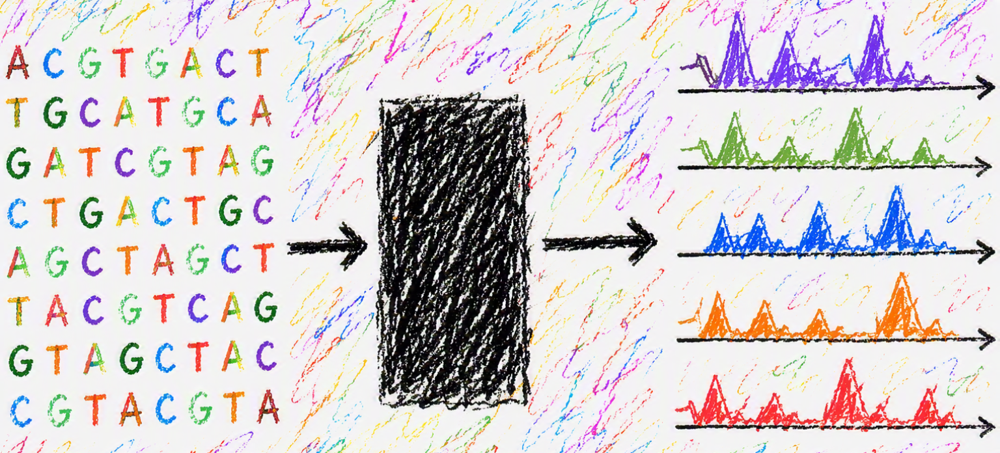
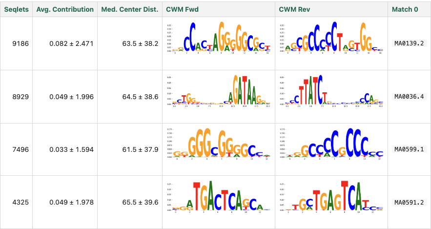



Cherimoya is a lightweight sequence-to-function (S2F) model for chromatin accessibility, adapting the [Chrom/BPNet](https://doi.org/10.1101/2024.12.25.630221) architecture into a far smaller and faster model through a redesigned convolutional block and custom GPU kernels. At 614K parameters (under 10% of ChromBPNet), it is small and fast enough to make the millions of forward passes that variant scoring, interpretation, and sequence design demand a practical proposition, rather than optimizing for benchmark scores alone.

Three things stand out:

- **Smaller and better.** Despite the tiny parameter count, Cherimoya beats ChromBPNet on both accessibility and variant effect prediction, and closes over half the gap to massive generalist models like Borzoi and AlphaGenome on counts prediction.
- **Fast enough to change what is feasible.** Custom GPU kernels make it roughly 6x faster than ChromBPNet at inference, and a single model trains in about 10 minutes on genome-wide data. Running ISM on CPU is faster than running Borzoi on a GPU.
- **Usable without code.** Command-line tools and agentic skills take you from raw reads to trained models, attributions, and motif calls without writing a line of Python.

**Code**: [cherimoya](https://github.com/jmschrei/cherimoya)



---

Genomic sequence-to-function (S2F) models use nucleotide sequence to predict genomic modalities, such as protein binding, chromatin accessibility, transcription, and alternative splicing. In recent years, these models have grown significantly in scale and can now make predictions for thousands of tracks simultaneously across hundreds of thousands of base pairs [1,2]. Although the details of these models’ architecture and training strategies differ significantly, there is usually one primary performance measure: how accurately they predict experimental readouts on held-out regions of the genome. *But, in our opinion, these sorts of predictions are the least interesting usage of S2F models.* After all, most assays for genomic modalities provide genome-wide readouts and there is no more "secret held-out genome" that one could make predictions for in the same way an image classifier can make predictions for new images.

Rather, we believe that the true value of S2F models is in their ability to do pretty much everything else: predicting variant (substitution, indel, structural) effects on phenotype, fine-mapping a set of candidate mutations to nominate putative drivers, dissecting the cis-regulatory logic encoded within individual loci of interest or globally, designing DNA with precise quantitative properties, prioritizing hypotheses by asking “what if?” questions before running experiments, etc. Predictive accuracy on held-out portions of the genome likely correlates somewhat well with performance on these tasks, but there are important distinctions. Exacerbating this issue, Rafi et al. [3] have raised concerns that the classic cross-chromosomal splits used for evaluation of S2F models may include homology leaks that sharpen this distinction, as model memorization of the training set translates into higher predictive performance on homologous regions in the validation and test sets but worse performance on downstream tasks.

Another challenge emerges when considering that each of these downstream tasks can require running S2F models thousands to millions of times. As an example, running *in silico* saturation mutagenesis on ~100k peaks of length ~1000bp requires ~300M forward passes. A model that is too big and/or too slow gives up much of its practical usefulness when it cannot be easily used at this scale, regardless of its benchmark score. In a world where academics are usually GPU-limited, especially for those whose research is not computationally focused, it is likely infeasible to use AlphaGenome for more than modest tasks. Taken together, these concerns mean that predictive performance should not be the only thing we consider when developing new S2F models.

These concerns motivated us to develop Cherimoya: a lightweight S2F model inspired by Chrom/BPNet [4,5]. Despite having only 614K parameters – less than 10% that of ChromBPNet – Cherimoya performs better at predicting observed chromatin accessibility readouts and at variant effect prediction. Through a combination of fewer parameters and custom GPU kernels, Cherimoya can run several times faster at its peak performance than ChromBPNet, and even faster than that when just matching performance. A single Cherimoya model can take as little as 10 minutes to train on genome-wide data, even when such data includes hundreds of thousands of peaks. This small footprint has huge consequences in terms of the scale of problems that one can tackle, and how quickly one can investigate interesting hypotheses. Finally, through a set of command-line tools and agentic skills, one can easily train and use Cherimoya models without needing to write a single line of code.

## Model architecture, Cheri blocks & model optimization

Cherimoya models mimic the architecture of Chrom/BPNet models: an initial convolution layer with a wide kernel to capture long patterns, a stack of dilated residual layers, and a branch point where one path applies another convolution with a wide kernel to convert the internal representations into profile predictions, and on the other path a global average pooling followed by a dense layer is used to predict the log of the total number of reads mapping to the region. This multi-task framework allows Cherimoya to predict both the shape and strength of the signal in the same forward pass.

The largest architectural difference between Cherimoya and Chrom/BPNet is that, instead of using dense dilated convolutions, Cherimoya introduces the Cheri Block, which is an adaptation of the ConvNeXt [6] architecture. The Cheri Block consists of a 3-tap dilated depthwise convolution, which pools information spatially but independently for each channel, a layer normalization that gets applied independently on each example in the batch, and a channel mixing MLP similar to that of the transformer layer. This can be viewed similarly to a factorization of the dense convolution, with information first aggregated spatially, and then subsequently aggregated across channels. Finally, a small fixed-scale residual multiplies each channel to keep deep stacks stable by holding the network near the identity at initialization, as the contribution from each Cheri Block is initially low. We found that despite being a fixed parameter, removal of this scaling operation almost always leads to catastrophic collapse in the training process. An important note is that, even though there are several operations performed in each Cheri block, there is only one non-linearity per block.

Although most individual PyTorch operations already have efficient CUDA implementations that are better than what anyone could write by hand, new architectural blocks offer sequences of operations that can benefit from custom GPU kernels. To explain at a high level, I/O is expensive for GPUs, and so one can get a big speedup when a GPU can perform multiple operations on the same data before writing the results back to memory. Sometimes, this involves reordering how computation is done to minimize I/O operations, and can result in unintuitive sequences of operations. We provide two such kernels for Cherimoya: a simple kernel that fuses the 3-tap dilated convolution with the subsequent layer-norm operation (in red), and a megakernel that fuses together the entire layer with minimal intermediary values (in yellow). The simple kernel is useful for training models because it caches intermediate values useful for speeding up the backward pass; the megakernel is only for inference and benefits explicitly by eliminating several I/O operations. In our timings, the simple kernel is around 3-4x faster than the PyTorch operations for those two layers, and the megakernel is around 2x faster at inference than a Cheri block with the simple kernel.

Several changes had to be made to the optimization of Cherimoya models to get the best performance out of these Cheri blocks.

**First**, instead of using a heuristic to set the balance between the log count loss and the profile loss, as introduced in the BPNet paper, we use Kendall-Gal [7] learned loss to automatically balance them. **Second**, instead of using a single Adam optimizer, we used (1) Muon [8] for the internal 2D matrices, (2) AdamW optimizer for the rest of the model parameters, and (3) SGD for the Kendall-Gal loss weights. **Third**, autoresearch was used to refine the precise architectural units and optimizer hyperparameters. Over 5,000 experiments were run across several sessions using [Evo](https://github.com/evo-hq/evo) (not to be confused with the Evo genomic LLM model). An entire blog post could be written about effective use of autoresearch, but here are four key points that we found:

- You need an objective fast enough for quick iteration. Cherimoya was ideal in this sense because training a model on a reasonably sized dataset took only 5-20 minutes.  
- Training deep learning models is noisy, and so running each idea a single time is not always a good estimate of the performance when small differences matter. We ran each experiment three times with different initializations and if the median was higher than the frontier, we ran an additional seven times (ten total) and only incorporated the idea if the median across all ten runs was better than the current frontier.   
- Autoresearch will overfit to whatever objective you give it, and almost all of the changes that lead to frontier performance on the autoresearch evaluation set will not generalize. This is where domain knowledge-driven skepticism plays a huge role in doubting weird choices, and where extensive external validation is necessary for confirming that the proposals generalize.  
- Even when the proposed changes generalize to larger datasets, many of them led to significantly worse performance on downstream tasks such as variant effect prediction. Potentially, this is related to the homology leakage issue pointed out by Rafi et al.

Nonetheless, autoresearch is invaluable when used carefully for converting free GPU time into incremental improvements. Even when proposals were unsuccessful, knowing that one is close to the frontier is important because, when developing a new model, one is sometimes left wondering if they are just one small change away from a big performance boost.

## Cherimoya sets a new Pareto frontier of performance and parameters

Everyone in machine learning is talking about [“Pareto frontiers”](https://en.wikipedia.org/wiki/Pareto_front) these days, which are the curves showing the best tradeoff between model complexity and performance, so we decided to do the same when comparing Cherimoya and ChromBPNet models. We compared the performance of Cherimoya models with an increasing number of filters per layer against the performance of officially released ChromBPNet models trained by the lab that developed the model. To get a better estimate of the frontier, we averaged across ten chromatin accessibility experiments. 

Our findings were somewhat surprising: Cherimoya reaches the same predictive performance for both tasks at 32 filters, using only 0.65% of ChromBPNet’s parameters. Performance improvements seem to level off around 128 filters, still less than 10% of the parameters of ChromBPNet, and so we used 128 filters as the default for modeling chromatin accessibility experiments moving forward. Somewhat interestingly, profile predictions continue to improve with complexity past the point where the count predictions level off. This may have implications for readouts where signal shape is more complex or informative, such as transcription initiation (e.g., Pro-CAP) experiments.

## Cherimoya approaches the performance of massive models

These initial results suggested that ChromBPNet models are undertrained given their parameter budget, potentially due to their use of dense operations and simple optimization strategies, and raise questions about whether other genomic models may also be undertrained. To investigate this, we wanted to compare Cherimoya’s performance against massive models like Borzoi and AlphaGenome. Although these models do use other computational layers and are known to outperform ChromBPNet, they are likely too massive to truly optimize the hyperparameters and architecture.

In an attempt to define a shared task, we evaluated all models on the common task of predicting the log counts in experimental peaks for 467 DNase experiments using sequence centered on that peak. For each model, we used the full receptive field (1M for AlphaGenome, ~500k for Borzoi). Additionally, we included an AlphaGenome model that only takes in 2kbp of input sequence so as to more closely mirror ChromBPNet/Cherimoya. For each peak in the Borzoi validation set (which corresponds to the AlphaGenome test set), we used the respective ChromBPNet/Cherimoya model where that peak was also in the validation set, to ensure that no model had seen those coordinates in their respective training sets. We consider the validation set as opposed to the test set here because the work is not yet complete, but anticipate little difference in trends between the two.

We observe the expected trends, with AlphaGenome (median performance 0.724) and Borzoi (0.736) significantly outperforming ChromBPNet (0.666), and with ChromBPNet outperforming the shrunken AlphaGenome (0.582). Perhaps surprisingly, we see that Cherimoya (0.704) closes over half of the gap between ChromBPNet and the larger models despite using over an order of magnitude fewer parameters. Interestingly, AlphaGenome struggled with several lung experiments (in pink) that the other models did not find challenging, and all models struggled to make predictions in HL-60. This suggests that one downside of massive multi-task models is that it is challenging to ensure that the models perform well on *all* tasks without a few dropping out. 

In doing this evaluation, we also considered the size of the model, the memory usage, and the inference speed, to provide a more comprehensive picture. Each model was benchmarked on the same H200 GPU using bfloat16 precision and `torch.compile(mode='max-autotune')` to ensure maximum throughput, with a warmup period ensuring that the first few slow inference passes do not influence the results. 

| Model | Params | Checkpoint | Peak VRAM (b=1) | Inference (ex/s) |
|---|---|---|---|---|
| Cherimoya | 0.6M | 2.5 MB | 0.14 GB | ~40,600 |
| ChromBPNet | 6.6M | 26 MB | 0.19 GB | ~6,900 |
| Borzoi | 186M | 744 MB | 17.9 GB | ~48 |
| AlphaGenome (1Mb) | 450M | 921 MB | 117 GB | ~10 |

At ~40K examples per second, Cherimoya is about 6x faster than ChromBPNet and hundreds to thousands of times faster than the foundation models. This is made possible, in part, by the megakernel that fuses the entire Cheri block for inference. But it is not the only component: a forward+backward step at batch 512 takes ~71 ms, against ChromBPNet's ~244 ms. 

## Cherimoya is a strong predictor of variant effect

As mentioned, predictive accuracy is only the first step in evaluating a model. Although it is encouraging that such a small model can perform so well on held-out data, we next evaluated Cherimoya’s performance at variant effect prediction. There are several datasets available for this task, but we chose to initially focus on one that was provided as part of the ChromBPNet work because it was well documented and simple to understand. In this setting, chromatin accessibility quantitative trait loci (caQTLs) were identified in African LCLs. Models trained to predict chromatin accessibility in LCLs from the ENCODE data were then used to score these caQTLs. A signed Pearson correlation was calculated over the difference in chromatin accessibility predictions between the reference and alternative alleles for the statistically significant caQTLs, in the same manner described in the original work; we did this for both a model trained on DNase-seq and one trained on ATAC-seq.

We see similar results here as in the previous prediction task: Cherimoya outperforms ChromBPNet, and AlphaGenome (all folds) performs the best. Although Cherimoya is not closing the gap quite as strongly here between ChromBPNet and AlphaGenome, it is still outperforming Borzoi and Enformer and providing a nice small boost relative to ChromBPNet.

## Cherimoya enables interpretation and design with a low compute budget

A motivation for developing *lightweight* models is to reduce the cost of training and using genomic S2F models in downstream tasks. Accordingly, we next set out to evaluate the speed of these models on downstream tasks.

The first such task is interpreting loci. A popular method for doing this is DeepLIFT/SHAP [9], which implements a correction to gradients to get interpretable saliency maps that more closely match Shapley values. However, DeepLIFT/SHAP requires custom correction operations for each non-linear operation and, as of the time of writing, there is no confirmed correction operation for layer normalization (though such work is currently underway). Consequently, we must use *in silico* saturation mutagenesis (ISM) for attribution with Cherimoya models, which calculates the importance of each nucleotide as the average difference in prediction if it were each of the other three nucleotide choices. 

A common critique of running ISM is that it is costly. Interpreting a 1kb locus requires running 3k forward passes. Fortunately, due to the megakernel, forward passes are where Cherimoya excels. To evaluate these timings more thoroughly, we compare the speed at which several models can interpret a 1kbp window within their original receptive fields. Below, we have the median speed of running ISM across 10 loci for several models, with both the GPU (at half precision) and CPU (at full precision) timings.

| model | cuda | cpu |  
|---|---|---|  
| cherimoya | 0.0846s | 18.9110s |  
| chrombpnet | 0.3785s | 70.9334s |  
| alphagenome2kb | 1.2375s | 284.7192s |  
| borzoi | 64.4582s | |  
| alphagenome | 324.2994s | |

Cherimoya is roughly 4.5x faster than ChromBPNet, in line with previous results. But perhaps more interestingly, running Cherimoya on a CPU is ~3x faster than running Borzoi on an H200 GPU. The ~20 seconds it takes Cherimoya on a CPU to do 3,000 forward passes may not be ideal for interactive analysis, but if one instead focused on 100 bp windows, a ~2 second cost is very manageable and brings the ability to interpret loci to those without a powerful GPU. Such speed even opens up the possibility of serving models on websites and having the compute done locally.

Next, we performed a similar analysis but with various design algorithms. Here, we chose to exclude the full Borzoi and AlphaGenome models as they would be extremely slow. With the remaining three models, we considered design tasks to increase the accessibility of a region using greedy substitution, a beam-search version of greedy substitution, [ledidi](https://github.com/jmschrei/ledidi) [10], which is a gradient-based design algorithm, and simple screening wherein sequences are randomly generated and the best-scoring ones are returned.

| model | greedy | ledidi | beam | screen (1000 it)|
|---|---|---|---|---|
| cherimoya | 0.0737 | 0.0068 | 0.2982 | 0.0097 |
| chrombpnet | 0.4353 | 0.0242 | 1.3781 | 0.0769 |
| alphagenome2kb | 2.5078 | 0.0530 | 11.8330 | 0.0559 |

We see similar results as before, with Cherimoya being several times faster than the other models. As Cherimoya and ledidi were both designed with speed as a primary concern, it is not surprising that Cherimoya + ledidi is 64x faster than ChromBPNet + greedy substitution, which is a more common design algorithm, and ~370x faster than AlphaGenome 2kbp + greedy substitution. 

## Python API and command-line interface

Now that we’ve convinced you that Cherimoya performs well, let’s talk about how to actually use it in practice.

There are two main ways to use Cherimoya models: the Python API and the command-line tools. The Python API largely focuses on defining the model architecture and training process, saving and loading models, while outsourcing the usage of the model after training to [tangermeme](https://github.com/jmschrei/tangermeme) [11], which is a general-purpose package for using S2F models. Although one can use the Python API directly to train models, our lab usually uses the command-line tools to get started and then loads the trained models into Python if we need to do bespoke analyses.

The command-line tools include the following commands:

- `cherimoya attribute`: Runs *in silico* saturation mutagenesis on a set of loci  
- `cherimoya evaluate`: Evaluates a trained model against observed data  
- `cherimoya fit`: Fits a model to observed data  
- `cherimoya marginalize`: Runs *in silico* marginalizations given a motif database  
- `cherimoya negatives`: Identifies GC-matched negatives for a set of peaks, no model involvement  
- `cherimoya seqlets`: Calls seqlets on attributions (from any methods) using the recursive seqlet caller in tangermeme

Each can be run individually, but likely the simplest way to go from raw data to trained models and outputs is via the `cherimoya pipeline` command, which handles data processing, model training, interpretation, seqlet calling/annotation, TF-MoDISco, and marginalizations by running through the above commands. The command is extremely flexible: you can start with read/fragment files or with bigWig files, you can pass in a control track if you have it, you can pass in peaks or have them called for you using MACS3, and likewise you can pass in negatives or have them called using a GC matching strategy based on the peaks. This graphic illustrates the flexibility one has in getting to a trained model.

The biggest obstacle for using these command-line tools is that each command requires a JSON that specifies paths to the relevant data and includes important hyperparameters. Defaults for these can be found on GitHub. Because the pipeline command requires a massive JSON – including one internal JSON for each step – a helper utility, `cherimoya pipeline-json`, can take in links to the important data and parameters and produce a template JSON that one can subsequently manually refine before running the `cherimoya pipeline` command.

### Quickstart guide

To demonstrate this in action, let’s look at an example of using the command-line tools to train and run Cherimoya models on an ATAC-seq experiment using the pipeline command. For this example, we will use the deeply sequenced K562 ATAC-seq experiment on the ENCODE Portal. 

First, we need to download the relevant files: the reference genome, a motif database (for characterizing the model-identified motifs), and the reads in BAM format.

`curl -Z -L -C - --fail --remote-name-all \`  
    `https://hgdownload.soe.ucsc.edu/goldenPath/hg38/bigZips/latest/hg38.fa.gz \`  
    `https://jaspar.elixir.no/download/data/2026/CORE/JASPAR2026_CORE_vertebrates_non-redundant_pfms_meme.txt \`  
    `https://encode-public.s3.amazonaws.com/2021/03/16/781bf763-825b-41df-9e58-c15a3e16f365/ENCFF534DCE.bam \`  
    `https://encode-public.s3.amazonaws.com/2021/03/16/d0607f6a-198b-4c38-94ba-9161359a5500/ENCFF128WZG.bam \`  
    `https://encode-public.s3.amazonaws.com/2021/03/16/e5948cab-16cc-4bfd-b1fb-93f192ca62d2/ENCFF077FBI.bam \`  
    `&& gunzip --keep -f hg38.fa.gz`

After downloading these files, we use `cherimoya pipeline-json` to create the pipeline JSON.

`cherimoya pipeline-json \`  
    `-s hg38.fa \`  
    `-i ENCFF534DCE.bam -i ENCFF128WZG.bam -i ENCFF077FBI.bam \`  
    `-m JASPAR2026_CORE_vertebrates_non-redundant_pfms_meme.txt \`  
    `-n k562_atac -o k562_atac.pipeline.json \`  
    `-ps 4 -ns -4 -u -pe`

This will create a properly formatted pipeline JSON file that is ready to run. Before doing so, you should manually skim it over and ensure there is nothing else you would like to change (such as batch sizes or any other processing or model settings that may be relevant but not exposed). When you’re ready to run the pipeline, you can run `cherimoya pipeline -p k562_atac.pipeline.json` and the steps will be performed sequentially. As a final note, a `"skip": true` argument can be passed into any JSON if you want to skip the step, and a trained model can be provided to skip model training and just perform the other steps. 

When the pipeline is complete, you will have several outputs: the trained model, attributions for the specified loci, annotated seqlet calls using tangermeme’s recursive seqlet caller and counts for the number of each annotation (i.e., how many motif instances of each type in a database were found highlighted by the attributions), *in silico* marginalizations for all motifs in a database, and TF-MoDISco results for *de novo* discovered motifs. For this example, the first few rows of the TF-MoDISco report should look like the following, and correspond to several motifs known to drive accessibility in K562. 

## Agentic tooling

The Cherimoya repository comes with built-in skills that use progressive disclosure to guide the agent in the right direction based on your prompt. We have found this to be immensely useful in creating scripts that we then refine, and when the agent wants to create small snippets to verify something. It is beautiful to see these agents go from writing long bespoke scripts that are challenging to audit to a small number of function calls from a package like Cherimoya or tangermeme. However, it is challenging to guarantee behavior from agents, especially as the underlying models are constantly changing. So, other than to mention that such skills exist and we have been happy with them internally so far, we will not go further here.

## Wrap up

Cherimoya is a lightweight S2F model that achieves strong performance despite its small parameter count. We have adopted it internally in the [Programmable Genomics Laboratory](https://programmable-genomics.github.io/) across a range of projects, and plan to continue expanding its scope, performance, and capabilities. To write like an AI: this is not just a one-off project; it’s a foundation for future work in the lab. As we scale up our design work from a small number of cell lines to targeting every cell type in a complex mammalian organ, such as the brain, lightweight models that can run quickly and fit easily in GPU memory are crucial.

*Cherimoya is from Christian Ramirez, Achsah Marlene Aruva, Zhiping Weng, and Jacob Schreiber (UMass Chan Medical School). Model and CLI code live in the [`cherimoya` repo](https://github.com/jmschrei/cherimoya); analysis tooling builds on `tangermeme`. Work is still in progress, and the final numbers and results will likely differ slightly from this blog post. Thanks to Anthropic for providing credits through their AI for Science program.*

## References

1\. Linder, J., Srivastava, D., Yuan, H., Agarwal, V. & Kelley, D. R. Predicting RNA-seq coverage from DNA sequence as a unifying model of gene regulation. *Nat. Genet.* 57, 949–961 (2025). [https://doi.org/10.1038/s41588-024-02053-6](https://doi.org/10.1038/s41588-024-02053-6)

2\. Avsec, Ž., Latysheva, N., Cheng, J., Novati, G., Taylor, K. R., Ward, T. et al. Advancing regulatory variant effect prediction with AlphaGenome. *Nature* 649, 1206–1218 (2026). [https://doi.org/10.1038/s41586-025-10014-0](https://doi.org/10.1038/s41586-025-10014-0)

3\. Rafi, A. M., Kiyota, B., Yachie, N. & de Boer, C. G. Characterizing homology-induced data leakage and memorization in genome-trained sequence models. *bioRxiv* (2026). [https://doi.org/10.1101/2025.01.22.634321](https://doi.org/10.1101/2025.01.22.634321)

4\. Pampari, A., Shcherbina, A., Kvon, E., Kosicki, M., Nair, S., Kundu, S., Kathiria, A. S., Risca, V. I., Kuningas, K., Alasoo, K., Greenleaf, W. J., Pennacchio, L. A. & Kundaje, A. ChromBPNet: bias factorized, base-resolution deep learning models of chromatin accessibility reveal cis-regulatory sequence syntax, transcription factor footprints and regulatory variants. *bioRxiv* (2024). [https://doi.org/10.1101/2024.12.25.630221](https://doi.org/10.1101/2024.12.25.630221)

5\. Avsec, Ž., Weilert, M., Shrikumar, A., Krueger, S., Alexandari, A., Dalal, K., Fropf, R., McAnany, C., Gagneur, J., Kundaje, A. & Zeitlinger, J. Base-resolution models of transcription-factor binding reveal soft motif syntax. *Nat. Genet.* 53, 354–366 (2021). [https://doi.org/10.1038/s41588-021-00782-6](https://doi.org/10.1038/s41588-021-00782-6)

6\. Liu, Z., Mao, H., Wu, C.-Y., Feichtenhofer, C., Darrell, T. & Xie, S. A ConvNet for the 2020s. *arXiv* (2022). [https://arxiv.org/abs/2201.03545](https://arxiv.org/abs/2201.03545)

7\. Kendall, A., Gal, Y. & Cipolla, R. Multi-Task Learning Using Uncertainty to Weigh Losses for Scene Geometry and Semantics. *arXiv* (2017). [https://arxiv.org/abs/1705.07115](https://arxiv.org/abs/1705.07115)

8\. Jordan, K., Jin, Y., Boza, V., You, J., Cesista, F., Newhouse, L. & Bernstein, J. Muon: An optimizer for hidden layers in neural networks. (2024). [https://kellerjordan.github.io/posts/muon/](https://kellerjordan.github.io/posts/muon/)

9\. Shrikumar, A., Greenside, P. & Kundaje, A. Learning Important Features Through Propagating Activation Differences. *arXiv* (2017). [https://arxiv.org/abs/1704.02685](https://arxiv.org/abs/1704.02685)

10\. Schreiber, J., Lorbeer, F. K., Heinzl, M., Reiter, F., Rafanel, B., Lu, Y. Y., Stark, A. & Noble, W. S. Programmatic design and editing of cis-regulatory elements. *bioRxiv* (2025). [https://doi.org/10.1101/2025.04.22.650035](https://doi.org/10.1101/2025.04.22.650035)

11\. Schreiber, J. tangermeme: A toolkit for understanding cis-regulatory logic using deep learning models. *bioRxiv* (2025). [https://doi.org/10.1101/2025.08.08.669296](https://doi.org/10.1101/2025.08.08.669296)
