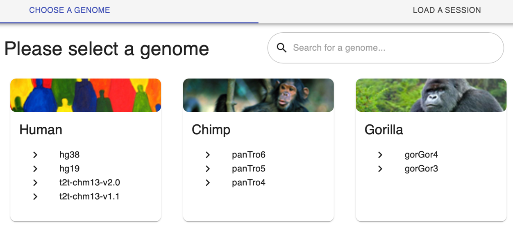


For quick and easy introduction to the latest ENCODE 4 deep learning models, we provide a **Quick-start guide** (5 min). Following the instructions, you should be able to create an **interactive genome browser session** to view a model's outputs, including experimentally observed signal, model-predicted signal, sequence contribution scores, and genomic motif instances.

**Contributions**:
- Primary contributors: Vivekanandan Ramalingam, Chang M. Yun, Vivian Hecht, Aman Patel, Anusri Pampari, Ziwei Chen, Johannes Linder, Soumya Kundu, Ivy Evergreen, Austin Wang, Daniel Kim, Eran Kotler
- Secondary contributors: Georgi K. Marinov, Kelly Cochran, Abhimanyu Banerjee, Surag Nair, Salil S. Deshpande, Zahoor Zafrulla, Riya Sinha
- Tertiary contributors: Alex M. Tseng, Amr Alexandari, Mahfuza Sharmin, Avanti Shrikumar, Jacob M. Schreiber, Caleb Lareau
- Corresponding contributors: Anshul Kundaje
- Blog post: Chang M. Yun, Vivekanandan Ramalingam, Vivian Hecht _(equal contributions)_


---

> This post is one of a series of blogs we will be releasing on the ENCODE Deep Learning Collection ("BPNet-GARDEN"). We plan to release the following posts:
> 1. Overview: What is the ENCODE Deep Learning Collection?
> 1. **Quickstart guide : How to access the ENCODE Deep Learning Collection (this post)**
> 1. Understanding regulatory DNA using deep learning models
> 1. A guide to the DECODE BPNet model resource for modeling TF binding
> 1. A guide to the DECODE ChromBPNet resource for modeling chromatin accessibility
> 1. Case study #1: Predicting the effects of non-coding variant mutations
> 1. Case study #2: MotifCompendium: A unified lexicon of regulatory sequence motifs
> 1. Case study #3: Understanding cell type-specific activity of cis-regulatory elements
> 1. Postscript: successfully running production-scale projects in an academic setting

## Quick-start guide (5 min)
Below, we review the basics of navigating an ENCODE model annotation page and explain how to load the most commonly used resource files into the WashU genome browser. 
We recommend visualizing the files as a first step in designing any larger-scale quantitative analyses.

We use the example of a **ChromBPNet model trained on ATAC-seq in K562 (ENCSR893SUD)**.

### Step 1: Find the model annotation page
Navigate to the ChromBPNet model annotation for ENCSR893SUD (ATAC in K562 cells): [https://www.encodeproject.org/annotations/ENCSR893SUD/](https://www.encodeproject.org/annotations/ENCSR893SUD/). 
The model annotations associated with an experiment can be found on the corresponding experiment summary page. 

.")

A list of all available annotations is also available here: [https://www.encodeproject.org/annotations/](https://www.encodeproject.org/annotations/).

### Step 2: Find the files of interest
To browse the available files, scroll down to the middle of the page and select the **“File details”** tab. 
For any initial exploratory analysis, we recommend comparing the normalized observed signal, the predicted signal and the counts contribution scores bigWigs.

.")

The following steps will require the URLs to these bigwigs, which can be found by right clicking the **download icon**, and clicking **“Copy link address”**. The links are provided here for convenience:

- **Normalized observed signal profile**: [https://www.encodeproject.org/files/ENCFF880ZUI/@@download/ENCFF880ZUI.bigWig](https://www.encodeproject.org/files/ENCFF880ZUI/@@download/ENCFF880ZUI.bigWig)
- **Normalized predicted signal profile**: [https://www.encodeproject.org/files/ENCFF296ICJ/@@download/ENCFF296ICJ.bigWig](https://www.encodeproject.org/files/ENCFF296ICJ/@@download/ENCFF296ICJ.bigWig)
- **Counts sequence contribution scores**: [https://www.encodeproject.org/files/ENCFF407GCO/@@download/ENCFF407GCO.bigWig](https://www.encodeproject.org/files/ENCFF407GCO/@@download/ENCFF407GCO.bigWig)

For more information regarding the various files that are available, see the [**ENCODE 4 preprint**](https://doi.org/10.64898/2026.07.06.731365).

### Step 3: Load the bigwigs into the WashU genome browser
Navigate to the WashU browser page: [https://epigenomegateway.wustl.edu/browser2022/](https://epigenomegateway.wustl.edu/browser2022/). On the home page, find the **“Human”** section and select **“hg38”** to open a new browser session:

After opening a new browser session, select the **“Tracks”** icon at the top of the page, and then select the **“Remote Tracks”** button from the dropdown menu:

.")

You should next see a window that looks like below:

.")

Copy and paste each of the first two URLs from Step 2 and add a label (e.g., observed and predicted, respectively). 
After each one first click **“Submit”** at the bottom of the window:

.")

Then click **“Add another track”**:

.")

For the third bigwig, the contribution scores, we will change the Track type to **Dynseq**, by clicking on the **“Track type”** box and scrolling to the fifth track option on the list:

.")

This allows us to visualize the contributions of individual nucleotides in the region to the predictions of the modelled assay (zoom in for the bases to render). 
Small clusters of high contribution score bases typically represent transcription factor binding motifs.

Add a label to this track: for example “counts contribution scores”.

The final browser view should look something like below:

.")

For additional information regarding how to use the WashU browser, see the documentation: [https://epigenomegateway.readthedocs.io/en/latest/usage.html](https://epigenomegateway.readthedocs.io/en/latest/usage.html).

## How else can I use the resources?
As part of the ENCODE Project, all data, models, analysis are shared **without restriction** at the [Project portal](https://www.encodeproject.org/). There are many other valuable resources available, so we highly recommend checking it out.

Additionally, we have tried our best to make the resource as user-friendly as possible: 
- **Models**: We have uploaded the models for open access on [**Hugging Face**](https://huggingface.co/collections/kundajelab/encode-bpnet-models) 
- **Model predictions, contributions and instance tracks**: We have created a [**UCSC Track Hub**](https://genome.ucsc.edu/cgi-bin/hgTracks?db=hg38&hubUrl=https://kundajelab.github.io/ucsc-trackhub-encode.github.io/hub.txt) for easy, interactive browser sessions
- **User guide**: We are currently building an _interactive_ user guide to help the community navigate and explain the resource (_work in progress_)
- **Preprint**: For more detail, the latest ENCODE preprint is out on [_bioRxiv_](https://doi.org/10.64898/2026.07.06.731365)

Lastly, we still have so much to share about the resource: we are planning to regularly share the many different ways you can use the resource (every week) for the foreseeable future, so give us a follow and be on the lookout for more!

## References
1. The ENCODE Project Consortium et al. The Encyclopedia of DNA Elements. _bioRxiv_ 2026.07.06.731365 (2026) ([https://doi.org/10.64898/2026.07.06.731365](https://doi.org/10.64898/2026.07.06.731365))
2. Li, D. et al. WashU Epigenome Browser update 2022, _Nucleic Acids Research_, Volume 50, Issue W1, (2022), Pages W774–W781. ([https://doi.org/10.1093/nar/gkac238](https://doi.org/10.1093/nar/gkac238))
3. Avsec, Ž. et al. Base-resolution models of transcription-factor binding reveal soft motif syntax. _Nat Genet_ 53, 354—366 (2021). ([https://doi.org/10.1038/s41588-021-00782-6](https://doi.org/10.1038/s41588-021-00782-6))
4. Pampari, A. et al. ChromBPNet: bias factorized, base-resolution deep learning models of chromatin accessibility reveal cis-regulatory sequence syntax, transcription factor footprints and regulatory variants. _bioRxiv_ 2024.12.25.630221 (2024). ([https://doi.org/10.1101/2024.12.25.630221](https://doi.org/10.1101/2024.12.25.630221))
5. Cochran, K. et al. Dissecting the cis-regulatory syntax of transcription initiation with deep learning. _bioRxiv_ 2024.05.28.596138 (2024). ([https://doi.org/10.1101/2024.05.28.596138](https://doi.org/10.1101/2024.05.28.596138))
6. Yun, C. M. et al. A unified lexicon of predictive DNA sequence motifs from ENCODE transcription factor binding and chromatin accessibility assays. (2025) doi:10.5281/zenodo.17179111. ([https://doi.org/10.5281/zenodo.17179111](https://doi.org/10.5281/zenodo.17179111))
